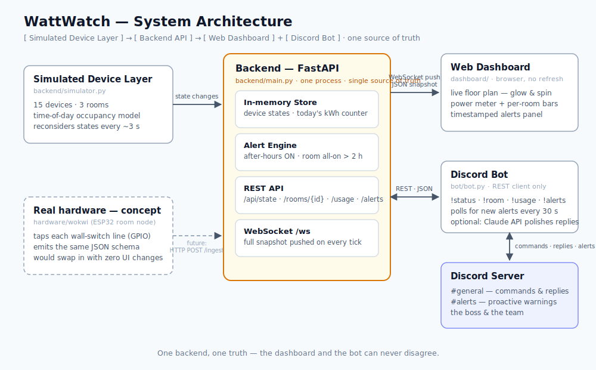

# WattWatch ⚡ — Lights, Fans, Discord

A live electricity monitor for a small three-room office, built for the
Techathon preliminary round. Everything is simulated (no hardware needed),
but the system is layered so a real ESP32 node could replace the simulator
without touching the UI or the bot.



One FastAPI process owns the simulated devices, the in-memory store, the
alert engine, the REST API, and a WebSocket feed — and it serves the
dashboard's static files too. The web dashboard receives a full snapshot
push on every simulator tick (no page refresh, no polling), while the
Discord bot is a deliberately separate process that only speaks to the REST
API over HTTP. Both interfaces therefore read the same live state and can
never disagree: **one backend, one truth**.

## Quickstart

```bash
python -m venv .venv
source .venv/bin/activate          # Windows: .venv\Scripts\activate
pip install -r requirements.txt
uvicorn backend.main:app --reload
```

Open http://localhost:8000 — you should see the floor plan with lights
glowing, fans spinning, the total wattage ticking, and (for the first ten
minutes) a seeded demo alert for Work Room 2.

## Discord bot

1. Go to the [Discord Developer Portal](https://discord.com/developers/applications)
   → **New Application** → give it a name → **Bot** tab → **Reset Token**
   and copy it.
2. Still on the Bot tab, enable **MESSAGE CONTENT INTENT** under
   *Privileged Gateway Intents* (the bot reads `!commands`, so this is
   required — forgetting it is the #1 reason the bot stays silent).
3. **OAuth2 → URL Generator**: scope `bot`, permissions *Send Messages* and
   *Read Message History*. Open the generated URL and invite the bot to
   your server.
4. `cp .env.example .env` and fill in `DISCORD_TOKEN`. For proactive alert
   posts, also set `ALERT_CHANNEL_ID` (enable Developer Mode in Discord's
   settings, then right-click a channel → *Copy Channel ID*).
5. With the backend already running, start the bot from the project root:

```bash
python -m bot.bot
```

| Command        | What it does                                        |
|----------------|-----------------------------------------------------|
| `!status`      | Whole office at a glance                            |
| `!room <name>` | One room — accepts `work1`, `Work Room 1`, `wr2`... |
| `!usage`       | Current watts + today's estimated kWh               |
| `!alerts`      | Anything left on that shouldn't be                  |
| `!help`        | Command list                                        |

Replies are humanized. If `ANTHROPIC_API_KEY` is set in `.env`, the bot
asks an LLM to phrase each reply conversationally (with the numbers passed
in verbatim — it never invents data, and any API failure silently falls
back to templates). Without a key it uses friendly built-in templates, so
the LLM is a bonus, never a dependency.

## The simulation model

Devices don't flip randomly; they drift toward a time-of-day occupancy
pattern. During office hours (9 AM–5 PM) work rooms target ~75% of devices
on and the drawing room ~35%, with a dip over lunch. The 8–9 AM and 5–7 PM
edges sit around 30% (people arriving and stragglers leaving), and at
night everything tends to off — except a small 5% "someone forgot" chance,
which is exactly what feeds the after-hours alert rule. Each tick
(3 s by default) every device gets a small chance to reconsider its state
against that target, so the office feels alive without being chaotic.

Two extra touches keep a fresh start from looking fake. First, today's
kWh counter is **backfilled** at startup by integrating the expected load
curve since midnight, then live-integrated from real device wattage every
tick — so at 3 PM the counter reads a plausible ~2 kWh instead of 0.001.
Second, Work Room 2 is seeded as fully ON since 2h15m ago and held for ten
minutes, so the 2-hour alert is visible the moment you open the dashboard
(disable with `SEED_ALERT_DEMO=0`).

To demo after-hours behaviour during the day, shift the office's clock:

```bash
SIM_CLOCK_OFFSET_HOURS=13 uvicorn backend.main:app
```

## Alert rules

1. **After hours** — any device ON outside 9 AM–5 PM, reported per room.
2. **All-on marathon** — every device in a room ON continuously for more
   than 2 hours.

Alerts carry a start timestamp, keep their message fresh while active
(the "2.4h straight" keeps counting), and move to a *recently resolved*
list when the condition clears — visible on the dashboard, queryable via
`!alerts`, and pushed proactively to the alert channel by the bot.

## API

| Endpoint            | Returns                                            |
|---------------------|----------------------------------------------------|
| `GET /api/state`    | Everything: devices, rooms, totals, energy, alerts |
| `GET /api/usage`    | Current watts, per-room watts, today's kWh         |
| `GET /api/rooms/{r}`| One room (friendly names/aliases accepted)         |
| `GET /api/alerts`   | Active + recently resolved alerts                  |
| `WS /ws`            | Full snapshot pushed on every simulator tick       |

## Hardware concept

`hardware/wokwi/` holds a representative one-room circuit (ESP32 + the
room's five devices) that runs on wokwi.com, plus `hardware/PINOUT.md`
with the pin map, import steps, and how the sensing maps to a real 220 V
office (optocoupler / current-sensor front-ends — never a GPIO on mains).
The node prints the same JSON schema the simulator uses, so real hardware
would swap in behind the backend with zero UI changes.

## A note on the device count (15 vs 18)

The problem statement specifies "2 fans and 3 lights" per room — which is
5 devices per room, 15 total — while also saying "6 devices per room,
18 devices total". Its own layout legend (6 fans + 9 lights) also sums
to 15. We honor the explicit per-room spec, and the counts are
configurable: setting `FANS_PER_ROOM=3` yields 18 devices with no code
changes (the floor-plan SVG is the one hand-drawn piece that would need a
matching edit; chips, bars, totals, alerts, and the bot all adapt
automatically).

## Configuration

| Env var                  | Default                  | Purpose                                   |
|--------------------------|--------------------------|-------------------------------------------|
| `DISCORD_TOKEN`          | —                        | Bot token (required for the bot)          |
| `ALERT_CHANNEL_ID`       | `0` (off)                | Channel for proactive alert posts         |
| `BACKEND_URL`            | `http://127.0.0.1:8000`  | Where the bot finds the backend           |
| `ANTHROPIC_API_KEY`      | — (optional)             | LLM-polished bot replies                  |
| `LLM_MODEL`              | `claude-sonnet-4-6`      | Model used for polishing                  |
| `SIM_CLOCK_OFFSET_HOURS` | `0`                      | Shift the office clock (demo after-hours) |
| `SEED_ALERT_DEMO`        | `1`                      | Seed the 2-hour alert at startup          |
| `TICK_SECONDS`           | `3`                      | Simulator tick interval                   |
| `FANS_PER_ROOM`          | `2`                      | See device-count note                     |
| `LIGHTS_PER_ROOM`        | `3`                      | See device-count note                     |

## Repo layout

```
backend/     FastAPI app, store, simulator, alert engine
dashboard/   static web dashboard (HTML/CSS/JS, WebSocket client)
bot/         Discord bot (REST client, optional LLM humanizer)
hardware/    Wokwi circuit + pinout & real-world sensing notes
diagrams/    hand-drawn system architecture (SVG)
```
